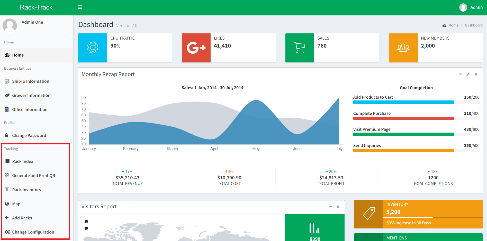

# Rack Tracking System - Demo

Note: The words "rack" and "cart" will be used interchangeably.

Please note that this website is a demo version created to showcase the functionality and design of the actual Rack Tracking System. Due to privacy and confidentiality concerns of the company it was designed for, Bert R. Hybels, the demo version provides only sample and minimal information.

Bert R. Hybels is a wholesale bedding plant distributor servicing roughly 3000 independent garden centers, nurseries, and landscapers throughout the United States.

The Rack Tracking System is a web application developed to address Bert R. Hybels' need for: 
- Tracking carts by Quick Response (QR) code
- Ease of access when it comes to communicating between growers, customers, and the hub
- Keeping the location and configuration of carts known

The actual website offers comprehensive and in-depth data, customized user profiles, and enhanced functionality tailored to the specific needs for three different types of users (Admin, Hub Worker, Truck Driver). The demo version provides the perspective of the admin, who is able to access majority of the functions.

## Website & Credentials
Website: https://wmu.carttrack.hybels.com  
Username: admin  
Password: password

## Getting Around
The main functionality of the Rack Tracking System is located in the Tracking Tab, as shown below.

